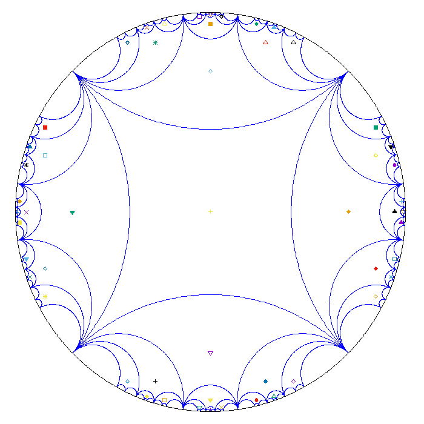

Hyperbolic tessellation
=======================

This script was written as part of job at the Heidelberg Institute for Theoretical Studies at the RTG group. It can compute the hyperbolic tesselation corresponding to discrete subgroups of the isometry group of the hyperbolic plane. This group can either be given by its generators in the form of 2x2-matrices or as pairs of identified geodesics (in this case the script needs the center and radius of the circle or the direction of the straight line). Afterwards, it builds up the corresponding Cayley graph of the group. Using this, the script computes the Dirichlet fundamental domain of the group around the center (in the Poincaré disk model) and translates this domain outwards a specified depth.

The image is generated via gnuplot.rb, hence there are many output formats available.

Example images
-----------------

Fundamental domain of a genus 2 surface with reflections up to a depth of 3

Fundamental domain of a genus 3 surface with reflections up to a depth of 3

Fundamental domain generated by the action of a Schottky group with reflections up to a depth of 3

Fundamental domain of a pointed torus with reflections up to a depth of 3

